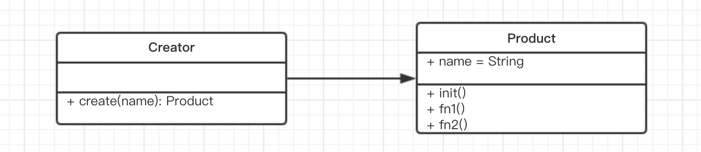

## 单例模式介绍

- 系统中被唯一使用
- 一个类只有一个实例


## 说明

- 单例模式需要用到java的特性(private)
- ES6中没有(typescript除外)
- 只能用java代码来演示UML图的内容

```java
public class SingleObject {
	// 注意，私有化构造函数，外部不能new，只有内部能new
	private SingleObject() {

	}
	// 唯一被new出来的对象
	private SingleObject instance = null;
	// 获取对象的唯一接口
	public SingleObject getInstance() {
		if (instance == null) {
			// 只 new 一次
			instance = new SingleObject()
		}
		return instance
	}
	// 对象方法
	public void login(username, password){
		System.out.printIn('login')
	}
}
// 测试代码
public class SingletonPatternDemo {
	public static void main(String[] args) {
		// 不合法的构造函数
		// 编译时错误：构造函数SingleObject()是不可见的！！！
		// SingleObject object = new SingleObject()

		// 获取唯一可用的对象
		SingleObject object = SingleObject.getInstance()
		object.login()
	}
}
```

```java
class SingleObject {
	login() {
		console.log('login..')
	}
}
// 定义一个静态方法
SingleObject.getInstance = (
	function () {
		let instance
		return function () {
			if (!instance) {
				instance = new SingleObject()
			}
			return instance
		}
	}
)()

// 测试代码
// 注意这里只能使用静态函数getInstance,不能new SingleObject
let obj1 = SingleObject.getInstance()
obj1.login()
let obj2 = SingleObject.getInstance()
obj2.login()
console.log('obj1 === obj2', obj1 === obj2) // true 两者必须完全相等

console.log('-----------------分割线------------------------')
let obj3 = new SingleObject() // 无法像JAVA一样完全控制
obj3.login()
console.log('obj1 === obj3', obj1 === obj3) // false 两者不相等
```

## 使用场景

- 登录框
- 购物车
- 线程池
- 全局缓存
- window对象
- alert，message等组件
- jQuery只有一个$
- vuex和redux中的store


### jQuery只有一个$

```java
if (window.jQuery != null) {
	return window.jQuery
} else {
	// 初始化...
}
```

### 模拟登录框

```java
class LoginForm {
	constructor() {
		this.state = 'hide'
	}
	show() {
		if (this.state === 'show') {
			alert('已经显示')
			return
		}
		this.state = 'show'
		console.log('登录框已显示')
	}
	hide() {
		if (this.state === 'hide') {
			alert('已经隐藏')
			return
		}
		this.state = 'hide'
		console.log('登录框已隐藏')
	}
}
LoginForm.getInstance = (function(){
	let instance
	return function() {
		if (!instance) {
			instance = new LoginForm()
		}
		return instance
	}
})()

// 测试代码
let login1 = LoginForm.getInstance()
login1.show()

let login2 = LoginForm.getInstance()
login2.hide()
// login2.show()
console.log('login1 === login2', login1 === login2)
```

## 总结

设计原则验证
- 符合单一职责原则，只实例化唯一的对象
- 没法具体体现开放封闭原则，但是绝对不违反开放封闭原则


