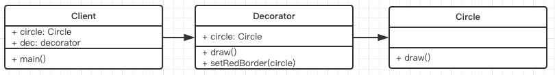

## 装饰器模式

- 为对象添加新功能
- 不改变其原有的结构和功能
- 原有的功能还可以继续用
- 例如手机和手机壳的关系

## UML类图



## 代码演示

```
class Circle {
	draw() {
		console.log('画一个圆形')
	}
}
class Decorator {
	constructor(circle) {
		this.circle = circle

	}
	draw() {
		this.circle.draw()
		this.setRedBorder(this.circle)
	}
	setRedBorder(circle) {
		console.log('设置红色边框')
	}
}

// 测试代码
let circle = new Circle()
let dec = new Decorator(circle)
dec.draw()
```

##  场景

- ES7 装饰器
- core-decorators

配置环境：
```
yarn add babel-plugin-transform-decorators-legacy --dev
```

```
{
	"plugins": ["transform-decorators-legacy"]
}
```

### ES7 装饰器

装饰类

```
// 一个小的Demo
@testDec
class Demo {
	// ...
}

function testDec(target) {
	target.isDec = true
}
alert(Demo.isDec) // true

// 可以加参数
function testDes(isDec) {
	return function(target) {
		target.isDec = isDec
	}
}
@testDec(true)
class Demo {
	// ...
}
alert(Demo.isDec) // true

```

```
// 装饰器的原理
@decorator
class A {}

// 等同于

class A {}
A = decorator(A) || A
```


### core-decorators

[core-decorators](https://github.com/jayphelps/core-decorators)

```
yarn add core-decorators
```

```
// 只读
import { readonly } from 'core-decorators'

class Person {
	@readonly
	name() {
		return 'zhang'
	}
}

let p = new Person()
alert(p.name())
```

```
// 废弃
import { deprecate } from 'core-decorators'

class Person {
	@deprecate
	facepalm() {}

	@deprecate('We stopped facepalming')
	facepalmHard() {}


	@deprecate('We stopped facepalming', { url: 'http://knowyourme.com' })
	facepalmHard() {}
}
```

## 设计原则验证

- 将现有对象和装饰器进行分离，两者独立存在
- 符合开放封闭原则


createStore的实现


