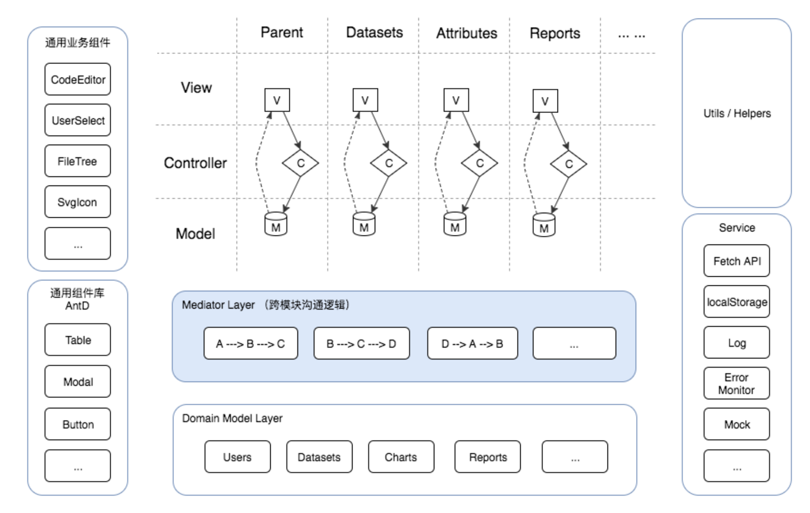
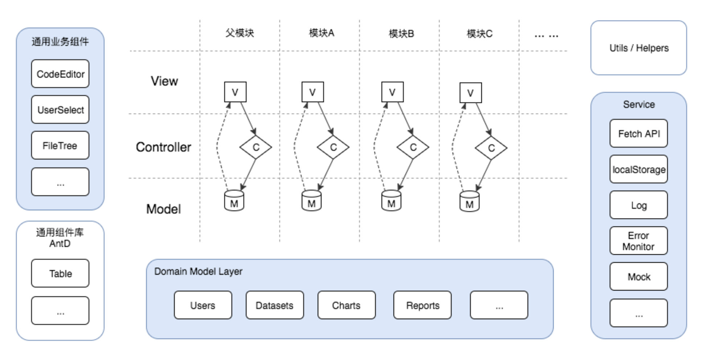

## ToB产品特点

* 业务复杂度高、业务理解门槛高；
* 前端代码量巨大

## 架构方案

架构的目的是管理复杂度，将复杂问题分而治之、有效管理

* 通过路由切割“页面级”粒度的功能模块
* 同一“页面”内的模块再划分
	* 纵向：通过业务功能（可根据视图模块判断）划分
	* 横向：通过Model-View-Controller三种不同职能划分
* 合并同类项：细分粒度，将可复用模块或组件抽离到公共区域
	* 数据模型：
		* Domain Model 领域模型：详见ORM层
		* App State Modal 应用状态模型：详见应用状态模型
	* UI组件：
		* Container Component： 详见容器型组件
		* Presentational Component：详见展示型组件
	* 公共服务：
		* 所有的HTTP请求放在一起统一管理
		* 日志服务、本地存储服务、错误监控、Mock服务等统一存放在公共服务层；
* 跨模块通信

## 合并同类项

### ORM层（Domain Model Layer）

持久化到数据库或localStorage中，属于可跨模块复用的公共业务数据
如：Users 用户信息 | Datasets 数据集信息 | Reports 报表信息

抽离该公共层的好处：
* 跨模块数据同步问题不复存在：
	例如：之前Users对象在A和B两个业务模块中单独存储，A模块变更Users对象后，需将Users变更同步到B模块中，如不同步，A、B模块在界面上呈现的User信息不一致，下沉到领域模型层统一管理后，问题不复存在；
* 除领域模型复用外，还可复用领域模型相关的CRUD Reducer：
	例如：之前Users对象对应的Create Read Update Delete方法可能在A和B两个业务模块各维护一套，下沉到领域模型层统一管理后，减少了代码重复问题；
* 自然承担了部分跨模块通信职责：
	之前数据同步相关的跨模块通信代码没有了存在的必要性；

### 应用状态模型

应用状态模型是与视图相关的状态数据：这些数据与具体的视图模块或业务功能强相关，建议存放在业务模块的Model中。
如：
* 当前页面选中了列表的第n行 currentSelectedRow: someId
* 窗口是否处于打开状态 isModalShow: false
* 某种视图元素是否在拖拽中 isDragging: true

### 容器型组件

容器型组件是与store直连的组件，为展示型组件或其它容器组件提供数据和行为，尽量避免在其中做一些界面渲染相关的事情。

### 展示型组件

展示型组件独立于应用的其它部分内容，不关心数据的加载和变更，保持职责单一，仅做视图呈现和最基本交互行为，通过props接收数据和回调函数输出结果，保证接收的数据为组件数据依赖的最小集。

如果展示型组件粒度切分能很好的遵循高内聚低耦合和职责单一原则的话，可以沉淀出很多可复用的通用业务组件。

## 跨模块通信

模块粒度逐渐细化，会带来更多的跨模块通信诉求，为避免模块间相互耦合、确保架构长期干净可维护，建议将跨模块通信的逻辑代码放在父模块中，或者在一个叫做Mediator层中单独维护

* 不允许在一个模块内部直接调用其他模块的Dispatch方法（写操作、变更其他模块的state）
* 不允许在一个模块内部直接读取其他模块的state方法（读操作）

## 数据流管理

纯函数：入参相同的情况下，返回值恒等
非纯函数：函数中如果包含 Math.random，new Date(), 异步请求等内容，且影响到最终结果的返回，即为非纯函数

监听Store变更刷新视图的功能是由react-redux完成的：

`<Provider>` 组件通过context属性向后代`<connect>`组件提供（provide）store对象；
`<connect>` 是一个高阶组件，作用是将store与view层组件连接起来（这里重复提一句，redux官方将`<connect>`直接连接的组件定义为container component），`<connect>`向开发者开放了几个回调函数钩子（mapStateToProps, mapDispatchToProps...）用于自定义注入container component的props的姿势；
react-redux监听redux store的变更，store改变后通知每一个connect组件刷新自己和后代组件，为了减少不必要的刷新提升性能，connect实现了shouldComponentUpdate方法，如果props不变的话，不刷新connect包裹的container component；

