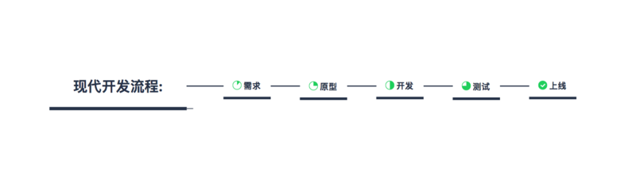

## 前言

如果一个大型项目没有合理的前端架构设计, 那么前端代码可能因为不同的开发人员随意的引入各种库和UI框架, 导致代码量变得异常臃肿, 最终结果可能是代码变得无法维护, 页面性能低下,不得已只能推翻重构. 所以我们需要在项目开始前, 同样的需要对前端代码进行架构, 一旦前端架构师设计出所有前端开发人员都要遵循的检验机制, 建立起系统设计的规范, 那么项目就拥有了可以衡量代码质量的标准, 前端开发人员也能享受到更高效的工作流。

>前端架构是一系列工具和流程的集合, 旨在提升前端代码的质量, 并实现高效, 可持续的工作流.

## 前端架构四个核心

代码 =》流程 =》测试 =》文档

## 流程

1. PM(产品经理)提出需求,并和开发人员讨论需求的具体细节和可行性
2. 需求确定之后, 发布出原型图和需求文档
3. 开发人员根据原型图和需求文档进行开发, 前端还需要UI(网页设计人员)提供设计图, 项目总监使用[JIRA](http://blog.csdn.net/gaowenhui2008/article/details/70241657)等项目管理工具来跟踪工作流
4. 搭建测试环境来测试代码, 开发人员完成功能开发并自测通过后, 提交给测试人员进行测试
5. 测试人员和需求方通过后, 将代码合并到远程的master分支, 并部署上线

### 需求

PM提出了明确的需求后. FE(前端开发人员)才能进行开发. 当然, 互联网行业中对于提出需求是否需要开发人员参与讨论是有不同的争议的, 有的人认为让开发人员参与需求阶段, 可能会因为开发人员的技术认知水平和惯性思维等因素, 限制PM提出一个有创意的需求. 也有的人认为应当让开发人员参与需求讨论, 因为可能因为PM完全不懂技术, 导致提出根本无法实现的需求.

毫无疑问, PM比起开发人员更加懂得需求, 因为他们会在告知开发人员需求之前完成需求收集, 需求描述, 需求全景图, 需求分析, 用户故事等一系列专业化的工作 . 但我赞同开发人员同时也在需求上能有一定的话语权, PM在需求表达阶段让UI, FE, BE(后端开发人员)参与讨论, 不仅能让开发人员更好的理解需求, 也可能让PM发现一些忽视的点, 从而更好的提出一个完整的方案.

**需求明确和需求确认**

 1. 关乎后台存储方案的设计的细节
 2. 产品语言与技术语言之间的沟通转换
 3. 交互细节
 4. 容错机制

### 原型图

1. PM进行需求验证的方式: PM在使用Axure画原型图的过程也是自己构思产品的过程, 经过原型图能够使得PM更加的理解产品.
2. 给需求方确认需求的工具: PM理解的需求可能和需求方的需求是有出入的, 设计出原型图作给需求方来验证需求的正确性是十分必要的.
3. UI设计出设计图的依据: 原型几乎有了整个界面的雏形, 拿到原型图后, UI能够更好的根据原型图和PM讨论其设计样式, 更快的交付出设计图给FE, 极大的降低了沟通成本.
4. 开发人员开发的依据: 初级的前端可能只会拿着设计图进行切图, 很可能切完图之后, 发现功能完全添加不进去的情况. 有经验的前端都会同时拿着设计图和原型图进行开发. 通过设计图在写html和css的同时通过原型图去写js的业务逻辑部分. 同时, 原型图也是后端开发人员提供业务接口的依据.
5. 测试人员测试的依据: 作为一个现测试人员，可以从原型快速了解产品的核心功能，和页面大致展现形式，方便测试人员提早了解需求，评估需求，制定测试计划，分配测试任务，然后各自开始编写测试用例

### 开发

1. 本地部署
如果公司没有一套标准的本地部署流程的话, 那么它会成为你敲代码前花费较多时间的一个部分, 可能包括拉取多个代码库, 配置服务器设置, 修改本机host或设置VPN. 不管流程是什么, 请一定要确保在README.md文件中说明每一步所对应的操作, 确保新的工程师能够很快的通过git clone xxx代码之后, 就能够将代码在本地运行起来. 千万不要低估README.md文件的重要性, 一个清晰的README.md文件可以让一个新入职的工程师在Git的远程仓库上拉代码之后几分钟就能运行起来. 当然, 对于一个依赖较多且配置项繁琐的项目, 如果缺少一个清晰的README. md文件, 花费几天的时间才在本地环境跑起来也是不足为奇的.

2. 创建功能分支
在多人开发的项目中, 是绝对不允许你直接在master分支下进行开发的, master分支有且只能用作保存上线版本的代码, 在开发过程中, 应该针对每个功能点通过git checkout -b newBranchName来创建一个新的功能分支, 在该功能分支上将该功能开发完毕并在本地进行了自测之后, 再将该功能分支merge到dev分支上, dev分支主要用来合并功能分支代码并交由测试人员进行测试, 当本次迭代所有的功能测试完毕之后, 才能够将dev分支上的代码merge到master分支上, 并准备上线.

3. 使用自动化工具(Gulp, Webpack等)
如果有一定工作年限的前端开发者, 那么一定经历过从Grunt转移到Gulp, 并在近两年转移到Webpack的过程. 这类的自动化工具, 能够极大的优化我们的工作流程, 帮助我们高效率的完成类似于自动刷新页面, 压缩CSS, JS和合并压缩代码等机械重复的体力活. 对于自动化工具对于开发人员的优点, 我看过下面这样一句话说得很好:

>每件事都是一个程序, 开发也像程序一样, 每个步骤都是一段代码, 当开发规模随着文档, 代码, 需求而增加时, 重复的步骤变得越来越多. 此时, 如果可以像抽象代码一样抽象出一些相同操作就可以大大提升开发效率. 因此, 出现了更多优质的工具来代替人工做一些不断重复的开发以减少程序员的工作量.

目前前端领域应该使用得最多的两个自动化工具就是Gulp和Webpack. 这两者在功能上有一定的区别, Gulp是一个自动化构建工具, 你可以通过丰富的插件在项目中自动的帮你执行常见的任务. Webpack是一个自动化打包工具, 通过一个入口文件, 将所有依赖的模块打包成为一个js文件, 当然你也可以通过code spliting将其切分为多个js文件, 按需加载以提高效率.

目前主流的前端框架(Vue, React和Angular)都是使用的Webpack进行打包, 就目前的使用来看, 通过各种loader和plugins, 几乎webpack能够满足所有的项目需求. 在前端架构中, 由于项目工程化的要求, 使用gulp和webpack这类的自动化工具进行项目的构建是必须的.

### 测试

测试是项目把关的最后一个环节, 经过了测试员这关才能把项目进行验收上线. 现在国内的网络公司由于项目工期的要求, 对于测试这一块, 大部分的做法还是雇佣能力水平一般的测试人员, 通过重复点击运行项目流程的方式进行测试, 对于测试工具的使用较少. 目前其实已经有了一批成熟的js测试工具, 例如Jasmine, Karma, Mocha, NightWatch.当你开始为应用程序规划测试时, 请记住以下几条建议:

测试用例应该在建站的同时, 甚至在建站之前就开始编写
测试代码是真实的代码, 应该一起或立即提交到系统代码库中
必须在所有的测试用例通过后, 才能把代码合并到主干中
在主干上运行测试工具, 结果应该都为通过才能上线
前端自动化测试的细节将在下一篇的文章中做详细的探讨, 这里我们只是强调测试在整个项目流程的必要性.

### 上线

在测试通过之后, 一个项目的最后流程就是上线了. 上线时采用JenKins这类的持续集成工具进行代码部署是一个优秀的架构所必须的, 持续集成工具能够在代码发布到服务器前, 先对代码进行一些处理, 这意味着我们可以在Git上忽略那编译后的资源. 以Vue的项目举例, 我们上线前只需要将在dev上测试通过的代码merge到master分支上, 在上传到远程Git仓库中. 在使用Jenkis进行部署上线就行, 一旦配置过上线前的处理流程, Jenkins就能自动帮我执行npm run build的操作并将build好的dist文件夹自动部署到服务器上.
