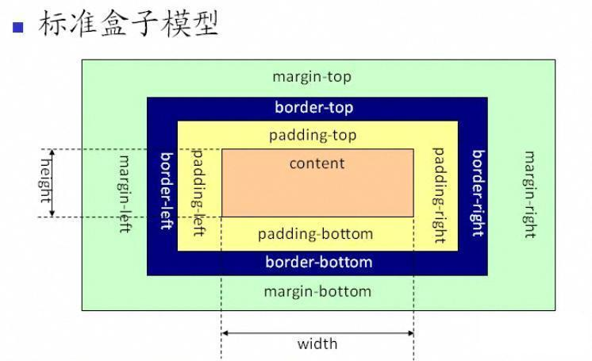

<!-- TOC -->

- [定位](#定位)
- [尺寸](#尺寸)
- [浮动（类似于PS中的图层）](#浮动类似于ps中的图层)
- [单列布局](#单列布局)
- [两栏布局](#两栏布局)
- [三栏布局](#三栏布局)
- [移动端](#移动端)

<!-- /TOC -->
## 定位

定义一个元素相对于其他正常元素的位置，它应该出现在哪里，这里的其他元素可以是父元素，也可以是浏览器窗口本身。

1. static：元素框正常生成。块级元素生成一个矩形框，作为文档流的一部分；行内元素则会创建一个或多个行框，置于其父元素中。
2. relative: 元素框相对于之前正常文档流中的位置发生偏移，并且原先的位置仍然被占据。发生偏移的时候，可能会覆盖其他元素。
3. absolute：元素框不再占有文档流位置，并且相对于包含块进行偏移(所谓的包含块就是最近一级外层元素position不为static的元素)
4. fixed：元素框不再占有文档流位置，并且相对于视窗进行定位
5. sticky:相当于relative和fixed混合。最初会被当作是relative,相对于原来的位置进行偏移；一旦超过一定阀值之后，会被当成fixed定位，相对于视口进行定位。

定位时的偏移量：top | right | bottom | left

1. static: 偏移量不会对static元素起到作用
2. relative: 它的偏移是相对于原先在文档流中的位置
3. absolute: 它的偏移是相对于最近一级position不是static的祖先元素的
4. fixed: 它的偏移量是相对于视口的

在做自适应布局设计时，往往希望这些偏移量的单位能够使用百分比，或者相对的单位例如rem等。

## 尺寸

* 百分比: 百分比的参照物是父元素，50%相当于父元素width的50%；
* rem: 这个对于复杂的设计图相当有用，它是html的font-size的大小
* em: 它虽然也是一个相对的单位，相对于父元素的font-size，但是并不常用，主要是计算太麻烦了。

盒子模型：可以通过box-sizing设置不同的模型。两种盒子模型，主要是width的不同

* 标准：width = content的宽度
* border-box: width = border + padding + content

1. width的默认值是auto，这个属性值会使得内部元素的长度自动填充满父元素的width。
2. height的默认值也是auto，auto表示的是浏览器自动计算。这种自动计算，需要一个基准，一般浏览器都是允许高度滚动的，所以，会导致一个问题——浏览器找不到垂直方向上的基准。

同样地道理也会被应用在margin属性上。相信如果考察居中时，水平居中你可能闭着眼睛都能写出来，但是垂直居中却绕着脑袋想。这是因为如果是块级元素水平居中只要将水平方向上的margin设置成auto就可以了。但是，垂直方向上却没有这么简单，因为你设置成auto时，margin为0。这个问题，还是需要仔细思考一下的。

## 浮动（类似于PS中的图层）

浮动的元素会在浮动层上面进行排布，而在原先文档流中的元素位置，会被以某种方式进行删除，但是还是会影响布局。
浮动元素，其实对于布局来说，是特别危险的。因为你可能这一块做过浮动，但未做清除，那么造成高度塌陷的问题。
* overflow: 将父元素的overflow，设置成hidden。
* after伪类：对子元素的after伪类进行设置。

## 单列布局


常见的单列布局有两种：
* 一种是header、content、footer宽度都相同，其一般不会占满浏览器的最宽宽度，但当浏览器宽度缩小低于其最大宽度时，宽度会自适应。

```html
<div class="layout">
  <div id="header">头部</div>
  <div id="content">内容</div>
  <div id="footer">尾部</div>
</div>
```

```css
  .layout{
  /*   width: 960px; *//*设置width当浏览器窗口宽度小于960px时，单列布局不会自适应。*/
    max-width: 960px;
    margin: 0 auto;
  }
```

* 一种是header、footer宽度为浏览器宽度，但content以及header和footer里的内容却不会占满浏览器宽度。

```html
<div id="header">
  <div class="layout">头部</div>
</div>
<div id="content" class="layout">内容</div>
<div id="footer">
  <div class="layout">尾部</div>
</div>
```

```css
  .layout{
  /*   width: 960px; *//*设置width当浏览器窗口宽度小于960px时，单列布局不会自适应。*/
    max-width: 960px;
    margin: 0 auto;
  }
```

## 两栏布局

一栏定宽，一栏自适应。这样子做的好处是定宽的那一栏可以做广告，自适应的可以作为内容主体。

实现方式：
1、float + margin

```html
<body>
  <div class="left">定宽</div>
  <div class="right">自适应</div>
</body>
```

```css
.left{
  width: 200px;
  height: 600px;
  background: red;
  float: left;
  display: table;
  text-align: center;
  line-height: 600px;
  color: #fff;
}

.right{
  margin-left: 210px;
  height: 600px;
  background: yellow;
  text-align: center;
  line-height: 600px;
}
```

2、position+margin:参考三栏布局第二种方法

## 三栏布局

两边定宽，然后中间的width是auto的，可以自适应内容，再加上margin边距，来进行设定。

1.float+margin：使用左右两栏使用float属性，中间栏使用margin属性进行撑开，注意的是html的结果
缺点是：(1)当宽度小于左右两边宽度之和时，右侧栏会被挤下去；(2)html的结构不正确

```html
<div class="left">左栏</div>
<div class="right">右栏</div>
<div class="middle">中间栏</div>
```

```javascript
.left{
  width: 200px;
  height: 300px;
  background: yellow;
  float: left;
}
.right{
  width: 150px;
  height: 300px;
  background: green;
  float: right;
}
.middle{
  height: 300px;
  background: red;
  margin-left: 220px;
  margin-right: 160px;
}
```

2.position+margin：使用position定位实现，即左右两栏使用position进行定位，中间栏使用margin进行定位

好处是：html结构正常。
缺点时：当父元素有内外边距时，会导致中间栏的位置出现偏差

```html
<div class="left">左栏</div>
<div class="middle">中间栏</div>
<div class="right">右栏</div>
```

```css
.left{
    background: yellow;
    width: 200px;
    height: 300px;
    position: absolute;
    top: 0;
    left: 0;
}
.middle{
    height: 300px;
    margin: 0 220px;
    background: red;
}
.right{
    height: 300px;
    width: 200px;
    position: absolute;
    top: 0;
    right: 0;
    background: green;
}
```

3、使用float和BFC配合圣杯布局(float + 负margin + padding + position)

将middle的宽度设置为100%，然后将其float设置为left，其中的main块设置margin属性，然后左边栏设置float为left，之后设置margin为-100%，右栏也设置为float：left，之后margin-left为自身大小。
缺点是：1. 结构不正确 2. 多了一层标签

```html
<div class="wrapper">
    <div class="middle">
        <div class="main">中间</div>
    </div>
    <div class="left">
        左栏
    </div>
    <div class="right">
        右栏
    </div>
</div>

```

```css
.wrapper{
    overflow: hidden;  // 清除浮动
}
.middle{
    width: 100%;
    float: left;
}
.middle .main{
    margin: 0 220px;
    background: red;
}
.left{
    width: 200px;
    height: 300px;
    float: left;
    background: green;
    margin-left: -100%;
}
.right{
    width: 200px;
    height: 300px;
    float: left;
    background: yellow;
    margin-left: -200px;
}
```

4、flex布局

除了兼容性，一般没有太大的缺陷

```html
<div class="wrapper">
    <div class="left">左栏</div>
    <div class="middle">中间</div>
    <div class="right">右栏</div>
</div>
```

```css
.wrapper{
    display: flex;
}
.left{
    width: 200px;
    height: 300px;
    background: green;
}
.middle{
    width: 100%;
    background: red;
    marign: 0 20px;
}
.right{
    width: 200px;
    height: 3000px;
    background: yellow;
}
```

## 移动端

1. 媒体查询
媒体查询的主要原理：给整个css样式设置了断点，通过给定的条件去判断，在不同的条件下，显示不同的样式。

@media:
* all， 所有媒体
* braille 盲文触觉设备
* embossed 盲文打印机
* print 手持设备
* projection 打印预览
* screen 彩屏设备
* speech ‘听觉’类似的媒体类型
* tty 不适用像素的设备
* tv 电视

例如：手机端的尺寸在750px，而PC端则是大于750px的

```css
@media screen and (min-width: 750px){
  .media{
    height: 100px;
    background: red;
  }
}

@media (max-width: 750px){
  .media{
    height: 200px;
    background: green;
  }
}
```

```css
@media screen {
  p.test {font-family:verdana,sans-serif;font-size:14px;}
}
@media print {
  p.test {font-family:times,serif;font-size:10px;}
}
@media screen,print {
  p.test {font-weight:bold;}
}
/*移动端样式*/
@media only screen and (min-device-width : 320px) and (max-device-width : 480px) {
  /* Styles */
}

```

2. flex弹性盒子

移动端会经常使用到flex布局，因为在简单的页面适配方面，flex可以起到很好的拉伸的效果。往往你并不需要去反复的使用媒体查询的。整整的响应式布局是使界面能够自动的根据屏幕进行变化，做到完美的弹性布局，在必要的时候，去使用媒体查询，对页面进行调整。

(1)容器：设定display:flex的地方

(2)项目：容器内部的直接子项就是flex item

(3)轴线(axis)：如坐标系，具备着x轴与y轴，flex在整个布局当中，也可分为水平方向和垂直方向，简称为主轴和交叉轴

* main start: 项目到容器的开始位置
* main end: 项目到容器结束的位置
* cross start: 交叉轴上面的开始位置
* cross end: 交叉轴上面的结束位置
* main size：项目的水平距离
* cross size：项目的垂直距离


(4)容器的基本属性

* (a) display：表示容器展示的布局类型，可设定为flex和inline-flex。两者的设定也就是inline和block的区别。当然了，在webkit内核的浏览器(safari)中使用时，需要在其前面加上前缀(-webkit-flex)

```css
.container{
    display: -webkit-flex;
    display: flex; /* or inline-flex*/
}
```

* (b) flex-direction: 表示容器内部子项目的展示方向。row | row-reverse | column | column-reverse

```css
.container{
    flex-direction: row   /* 默认 行正序*/ ||  row-reverse /*行倒序*/ ||  column  /* 列正序*/ || column-reverse /*列倒序*/
}
```


* (c) flex-wrap: 表示当容器内部内容超出容器时，容器是否分行展示 
    * nowrap(浏览器默认，不分行) 
    * wrap(超出的部分分行处理)
    * wrap-reverse(分行逆序)

```css
.container{
   flex-wrap: nowrap || wrap || wrap-reverse;
}
```


* (d) flex-flow: 这个属性就是可以将上面两个属性合起来写的属性，

```css
.container {
    flex-flow: row wrap;
}
```
* (e) justify-content: 表示容器内部的子项目的水平对齐方式。而水平的对齐方式主要有六种: 
    * flex-start: 对应的对齐方式是水平向左对齐。（浏览器默认）
    * flex-end: 对应的对齐方式是水平向右对齐。
    * center: 对应的对齐方式是居中对齐。
    * space-between: 对应的是，每个元素之间中间流出间隙是一样的，两边无间隙。
    * space-around: 对应的是，每个元素周围的间隙是一样的，而不是元素之间的，因此，可以从图中看出两边的间隙会比中间小一半。
    * space-evenly：对应的是，每个元素之间的间隙大小一致。


```css
 justify-content: flex-start || flex-end || center || space-between || space-around || space-evenly
```
* (f) align-items:表示容器内部的子项目的垂直对齐方式。而垂直的对齐方式主要有五种: 
    * flex-start: 对应的对齐方式是垂直向上对齐。
    * flex-end： 对应的对齐方式是垂直向下对齐。
    * center：对应的对齐方式是垂直居中对齐。
    * stretch：对应的对齐方式是将整个子项目的长度拉伸到最大块的高度(浏览器默认)
    * baseline： 对应的对齐方式是子项目内部的文字基线对齐。

```css
.container{
    align-items: flex-start || flex-end || center || stretch || baseline;
}
```


* (g) align-content: 表示在对行的情况下，每行所对应的垂直方向上的对齐方式。主要有六种对齐方式：

    * flex-start：对应的是每一行在垂直方向上向上对齐的方式
    * flex-end：对应的是每一行在垂直方向上向下对齐的方式
    * center：对应的是每一行在垂直方向上居中对齐的方式
    * stretch：对应的是每一行延展到铺满整个垂直方向。
    * space-between：对应的就是每行之间留有空隙，而两边没有空隙
    * space-around：对应的就是每行周围的空隙均相等


(5) 项目的属性
* (a)order：子项目的排列顺序。通常，默认情况下，子项目都是按照默认顺序进行排序的。但是，有时候你或许需要将后面的元素拿上来，那你就可以使用order这个属性,正如图中展示的：

```css
order: <integer>  //如1
```


* (b) flex-grow: 表示的是元素的所占空间的比例.在设置每个元素flex-grow为1时，一行内的子元素都是均分的，即1：1：1。但是，如果你给第一个元素设置flex-grow为2时，它们的比例就会变成2：1：1。如图：

```css
flex-grow: <integer> /默认为0/
```


* (c) flex-shrink: 表示子项目的伸缩

```css
flex-shrink:  number  /*default to 1*/
```

* (d) flex-basis: 表示子项目的长度,默认为auto。当设置flex-grow时，长度就为flex-grow的value，如果没有，就是块本身内容的大小。

```css
flex-basis：<length> | auto   /*default auto*/
```

* (e) flex: flex-grow、flex-shrink和flex-basis的集合写法，默认为0，1，auto

```css
flex: <flex-grow> <flex-shrink> <flex-basis>
```

* (f) align-self: 表示子项目在垂直轴线上的放置方式。

```css
align-self: auto | flex-start | flex-end | center | stretch | baseline
```

3. rem适配

rem可以说是移动端适配的一个神器。这种界面有个特点就是页面元素的复杂度比较高，而使用flex进行布局会导致页面被拉伸，但是上下的高度却没有变化等问题。
[从网易与淘宝的font-size思考前端设计稿与工作流](http://www.cnblogs.com/lyzg/p/4877277.html)