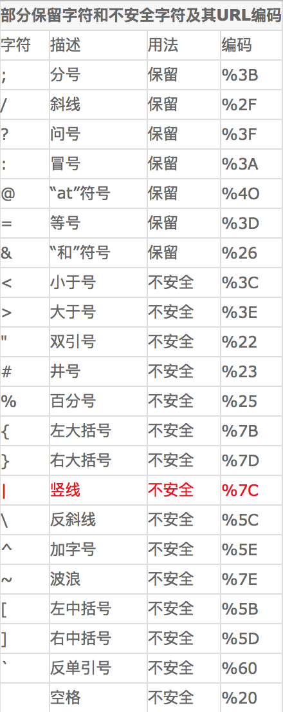

# package.json的解读

## json和JS对象的区别

package.json，顾名思义，它是一个json文件，而不能写入JS对象。
所以我们首先要搞懂的是JSON和JS对象的区别：

| 区别 | Json | Javascript对象 |
|----|------|--------------|
| 含义 | 仅仅是一种数据格式| 表示类的实例|
|传输|可以跨平台数据传输，速度快|不能传输|
|表现|1、键值对方式，键必须加双引号</br>2、值不能是方法函数，不能是undefined\|NaN|1、键值对方式，键不加引号</br>2、值可以是函数、对象、字符串、数字、boolean等</br>|
|相互转换|Json转化为JS对象：</br>1、JSON.parse(jsonstring);</br>2、json=eval("("+jsonstring+")")|JS对象转换为JSON:</br>JSON.stringify(json)|

【注意】 在JSON中属性名一定要加上双引号

## name字段

**name字段的限制**

+ name字段必须小于214字符（这个没什么好记的～）
+ name字段不能包含有“.”符号和下划线（这个要记一下哦～）
+ name字段不能包含有大写字母（这个要记一下哦～）
+ name字段不能含有非URL安全的字符，因为它将当发布的时候，它将作为你的包的相关信息被写入URL中
那么，有哪些算是非URL安全的字符呢？咱们看表说话：


## version字段

### npm对version定义的规则要求

对于"version":"x.y.z"
1.修复bug,小改动，增加z
2.增加了新特性，但仍能向后兼容，增加y
3.有很大的改动，无法向后兼容,增加x
 
例如：我原本的项目是1.0.0版本的话
若是1中情况，变为1.0.1
若是2中情况，变为1.1.0
若是3中情况，变为2.0.0

### npm有自己的检验version的模块——node-semver

npm有自己的一套检验version正确性的模块，它叫做 node-semver，是一开始就跟随着npm一起被打包安装的。当然了，你也可以通过自己安装去在自己的项目中使用它。
使用的例子像这样：
先npm install --save semver
然后:

```javascript
const semver = require('semver')
semver.valid('1.2.3') // '1.2.3'
semver.valid('a.b.c') // null
```

## keywords和description字段

### 字段要求：
description：字符串
keywords：字符串数组

简单地说，这两个东东是npm搜索系统中的搜索条件，所以。如果你试图发布的是一个开源插件，那么这两个字段你应该重视

## license字段

这是你指定的项目的许可证，它告诉他人他们是否有权利使用你的包，以及，在使用你的包的时候他们应该受到怎样的限制

字段要求：
单个license：直接写入名称

```json
{ "license" : "BSD-3-Clause" }
```

多个license：在一对圆括号内写入license名称，且在多个license内用AND等连接

```json
{ "license" : "(ISC AND GPL-3.0)" }
```

[SPDX license表达式的语法规则 2.0版本](https://www.npmjs.com/package/spdx)

## author字段

要求：一个字符串或是一个对象。
如果是一个对象，该对象包含三个属性：
name属性(必填)
email属性（选填）
URL属性（选填）

```json
{ "name" : "Barney Rubble"
, "email" : "b@rubble.com"
, "url" : "http://barnyrubble.tumblr.com/"
}
```

## main字段

这个是你项目的入口文件。简而言之，当别人安装了你发布的模块时，require你的模块的时候取得的就是你main字段规定的入口文件的输出。
 
例如你写入了 { "main":"XXX.js"}，而他人通过npm install '你的模块名称' . 安装了你的模块后，他通过 var X = require('你的模块名称')取得的就是你在XXX.js的输出

## script字段

写进scripts的命令(command),可以通过npm run <command>或者npm <command> 运行对应的shell指令，例如：{"scripts": { "start": "node main.js"} } 可以让你在终端输入npm start的时候，等同于运行了node main.js

### 什么时候要加“run”,什么时候可以不用加“run”呢？

一个让我们可能有些困扰的问题是，通过`script`字段内的`npm命令`运行脚本时，有时候要加`“run”`，有时候又不要加`"run"`,即有时候是可以直接用`npm <command>`；而有时候又要用`npm run <command>` 才能运行脚本，这该如何区分呢？
 
首先要提一下的是，`run`的原名是`run-script`，是一段脚本，而`run`是它的一个别名（`alias`）
 
1.当`run[-script]`被 `test, start, restart, and stop`这四个自带的命令所使用时，它可以被省略（或者说不需要加`“run”`就可以直接调用），所以我们平时最常输入的`npm start`实际上相当于`npm run start`，只不过是为了方便省略了`run`而已
 
原文：`run[-script] is used by the test, start, restart, and stop commands, but can be called directly`
 
2.当你在`package.json`的`script`字段中定义的是除了1中的4个命令外的命令的时候，你就不能省略`“run”`了
例如你定义

```json
"scripts": {
  "build": "XXX.js"
}

```
的时候，你运行XXX.js就只能通过npm run build去运行了

### npm为script字段中的脚本路径都加上了node_moudles/.bin前缀

npm为script字段中的脚本路径都加上了node_moudles/.bin前缀，这意味着：你在试图运行本地安装的依赖在 node_modules/.bin 中的脚本的时候，可以省略node_modules/.bin这个前缀。例如：
我刚npm install webpack了，而在我的项目下的node_modules目录的.bin子目录下：就多了一个叫做webpack的脚本

本来运行这个脚本的命令应该是：node_modules/.bin webpack
但由于npm已经自动帮我们加了node_modules/.bin前缀了，所以我们可以直接写成：

```json
"scripts": {"start": "webpack"}
```

而不用写成：

```json
"scripts": {"start": "node_modules/.bin webpack"}
```

> 原文：npm run adds node_modules/.bin to the PATH provided to scripts. Any binaries provided by locally-installed dependencies can be used without the node_modules/.bin prefix

>npm start是有默认值的，默认为：node server.js

## better-npm-run的安装与betterScript字段的使用

这个是package.json文档介绍里所没有的，但这里我想特别讲一下：
 
先通过npm install better-npm-run安装好包，然后你就可以在你的package.json里面使用一个新的字段—— "betterScripts"字段
 
故名思意，它和"scripts"字段很像，那么两者间有什么联系呢？咱还是用代码说话吧，它可以把

```json
"scripts": {
   "test": "NODE_ENV=production karma start"
}
```

变成：

```json
"scripts": {
    "test": "better-npm-run test"
},
"betterScripts": {
    "test": {
        "command": "karma start",
        "env": {
            "NODE_ENV": "test"
          }
       }
}
```

简单地说，就是当运行"scripts"字段中的命令的时候，它会进一步去运行 "betterScripts"中对应的命令，并通过"env"对象控制运行时的环境变量，如NODE_ENV。
 
好处是让你的代码的可读性更强一些
 
另外提一下NODE_ENV的作用：
用来设置环境变量（默认值为development）。
通过检查这个值可以分别对开发环境和生产环境下做不同的处理
 
例如在服务端代码中通过检查是否是开发环境（development）决定是否启动代码热重载功能

（热重载只是为了在开发环境【developmen】提高生产效率用，在生产环境【production】没用）

```javascript
if (process.env.NODE_ENV === 'development') {
// 省略诸多内容
app.use(require('webpack-hot-middleware')(compiler, {
    path: '/__webpack_hmr'
}))
}
```

## dependencies字段和devDependencies字段

dependencies字段和devDependencies字段分别代表生产环境依赖和开发环境依赖
 
与两个字段相关的npm install的命令
npm install 模块 --save 安装好后写入package.json的dependencies中（生产环境依赖）
npm install 模块 --save-dev 安装好后写入package.json的devDepencies中（开发环境依赖）

**怎么区分到底安装包的时候放在dependencies中还是devDepencies中呢？**

很简单
1.一般你去github或者npm社区里面相关包的介绍后面都会带有--save 或者--save-dev 的参数的，这时候把命令直接复制过来运行就OK了，不用管那么多
 
2.如果没有1中的介绍，那么请思考，这个包到底是纯粹为了开发方便使用呢？还是要放到上线后APP的代码中呢？前者则为devDepencies，后者则为dependencies
 
【注意】：在团队协作中，一个常见的情景是他人从github上clone你的项目，然后通过npm install安装必要的依赖，（刚从github上clone下来是没有node_modules的，需要安装）那么根据什么信息安装依赖呢？就是你的package.json中的dependencies和devDepencies。所以，在本地安装的同时，将依赖包的信息（要求的名称和版本）写入package.json中是很重要的！