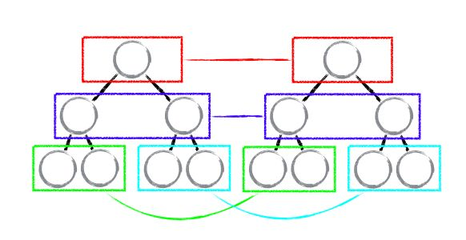

## 传统diff算法

通过循环递归对节点进行依次对比
算法复杂度：O(n^3)

## React diff

React巧妙的引入启发式算法思路，使用试探法将O(n^3)复杂度的问题转成非最优但高效的O(n)复杂度的问题

### Diff策略

+ web UI 中DOM节点跨层级的移动操作特别少，可忽略不计(tree diff)
+ 拥有相同类的两个组件将会生成相似的树形结构，拥有不同类的两个组件将会生成不同的树形结构(component diff)
+ 对于同一层级的一组子节点，它们可以通过唯一ID进行区分(element diff)

#### tree diff

策略：对树进行分层比较，两棵树只会对同一层次的节点进行比较。
既然DOM节点跨层级的移动操作少到可以忽略不计，React通过updateDepth对Vitual DOM 树进行层级控制，只会对相同颜色方框内的DOM节点进行比较，即同一个父节点下的所有子节点。当发现节点已经不存在，则该节点及其子节点会被完全删除掉，不会用于进一步的比较。这样只需要对树进行一次遍历，便能完成整个DOM树的比较。


```javascript
updateChildren: function(nextNestedChildrenElements, transaction, context) {
    updateDepth++;
    var errorThrown = true;
    try {
        this._updateChildren(nextNestedChildrenElements, transaction, context);
        errorThrown = false;
    } finally {
        updateDepth--;
        if (!updateDepth) {
            clearQueue();
        } else {
            processQueue();
        }
    }
}
```

当DOM节点跨层级移动：

A节点(包括其子节点)整个被移动到D节点下，由于React只会简单的考虑同层节点的位置变换，而对于不同层级的节点，只有创建和删除操作。当根节点发现子节点中A消失了，就会直接销毁A；当D发现多了一个子节点A，则会创建新的A(包括子节点)作为其子节点。此时，React diff的执行情况：create A -> create B -> create C -> delete A

由此可见，当出现节点跨层级移动时，并不会出现想象中的移动操作，而是以A为根节点的树被整个重新创建，这是一种影响React性能的操作，因此React官方建议不要进行DOM节点跨层级的操作。

注意：在开发组件时，保持稳定的DOM结构会有助于性能的提升。例如，可以通过CSS隐藏或显示节点，而不是真的移除或添加DOM节点。

#### component diff

策略：
+ 如果是同一类型的组件，按照原策略继续比较 virtual DOM tree
+ 如果不是，则将该组件判断为dirty component,从而替换整个组件下所有的子节点
+ 对于同一类型的组件，有可能其Virtual DOM没有任何变化，如果能够确切的知道这点，则可以节省大量的diff运算时间，因此React允许用户通过shouldComponentUpdate()来判断该组件是否需要进行diff
例如：


当component D 改变为 component G时，即使这两个component结构相似，一旦React判断D和G是不同类型的组件，就不会比较二者的结构，而是直接删除component D，重新创建component G 以及其子节点。虽然当两个component是不同类型但结构相似时，React diff会影响性能，但是：不同类型的component是很少存在Dom tree 的机会的，因此这种极端因素很难在实现开发过程中造成重大影响的。

#### element diff

策略：
+ INSERT_MARKUP(插入)：
    新的component类型不在老集合里，即是全新的节点，需要对新节点执行插入操作。
+ MOVE_EXISTING(移动)：
    在老集合有新component类型，且element是可更新的类型，generateComponentChildren已调用receiveComponent,这种情况下preChild=nextChild,就需要做移动操作，可以复用以前的DOM节点。
+ REMOVE_NODE(删除)：
    老component类型，在新集合里也有，但对应的element不同则不能直接复用和更新，需要执行删除操作，

## 参考资料

[Reconciliation - React](https://reactjs.org/docs/reconciliation.html)