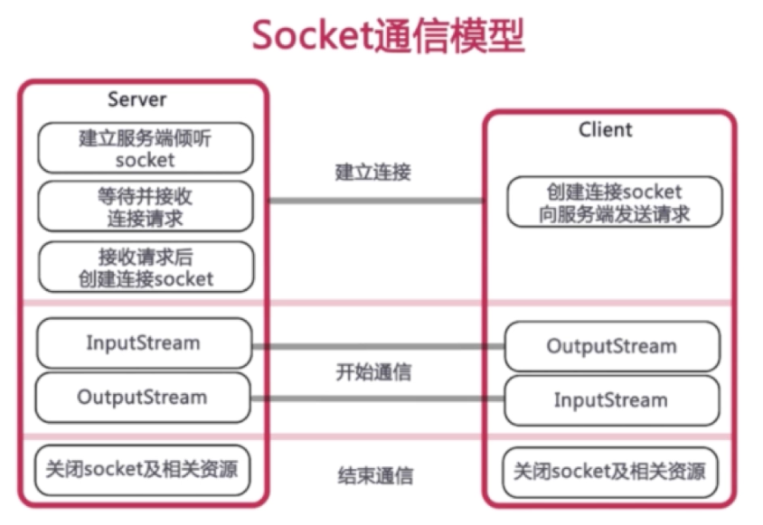

## 技术栈

前端页面：登录 | 完善信息 | 牛人列表 | BOSS列表 | 消息列表 | 聊天详情
前端支撑：components-mobile | redux | react-router4 | axios | create-react=app | 第三方组件
后端支撑： Express | Socket.io | mangodb

## create-react-app 

```bash
sudo npm install -g create-react-app yarn
create-react-app performance-demo
cd performance-demo
yarn start
yarn run eject  # 将所有内建的配置暴露出来
```

## express

* app.get | app.post 分别开发get和post接口
* app.use使用模块
* res.send | res.json | res.sendfile 响应文本 | json | 文件
* 参数获取
  * get
    * req.query.[name]
    * JSON.stringify(req.query)
  * post
    * req.body.[pName]
  * 其他信息
    * req.header(field)：获取请求的头信息
  * route
    * req.route
  * cookies
    * req.cookies
  * hostname
    * req.hostname
  * ip
    * req.ip
  * originalUrl
    * req.originalUrl
  * protocol
    * req.protocol
  * secure
    * req.secure：用来判断协议是否安全,如果是https，返回的就是true
  * xhr
    * req.xhr：判断是否是异步请求


新建配置文件server.js

```javascript
const express = require('express');
c
// 新建app
const app = express()
app.get('/', function (req, res) {
  res.send('<h1>hello world</h1>');
})
app.get('/data', function (req, res) {
  res.json({name:'imoonmmsjjsjus',type:'IT'})
})
app.listen(9093, function () {
  console.log('Node app start at port 9093');
})
```

## Mongodb + mongoose

1、Mac下安装:`brew install mongodb`
2、创建数据库目录

```bash
data/
	conf	-->配置文件目录
		mongod.conf		-->配置文件
	db		-->数据库目录
	log		-->日志文件目录
		mongodb.log		-->日志记录文件
```

3、启动数据库
`mongod --config /usr/local/etc/mongod.conf`
新启动一个命令行工具：执行`“mongo“`,出现类似下图则表示安装成功


4、用node中的mongoose模块连接express和mongodb
`npm i mongoose --save`

在服务器配置文件server.js中配置：

```javascript
const mongoose = require('mongoose')
// 链接mongo,并且使用react这个集合(如果没有react集合，则会自动新建)
const DB_URL = `mongodb://127.0.0.1:27017/react`
mongoose.connect(DB_URL)
mongoose.connection.on('connected', function () {
  console.log(`mongo connect success`);
})
```

5、封装mongoose
Connect链接数据库
定义文档模型，Schema 和 model 新建模型

```javascript
// 类似于mysql的表，mongo里有文档、字段的概念
// 通过mongoose操作mongodb，存储的就是json，相对mysql来说，要易用很多
const User = mongoose.model('user', new mongoose.Schema({
  user: {type: String, require: true},
  age: {type:Number, require: true}
}))
```
String,Number等数据结构

6、增删改查
create | remove | update 分别用来增 | 删 | 改 的操作
find | findOne（找到一条立即返回，剩下的不管） 用来查询数据
findByIdAndUpdate 查找并且更新

```javascript
// 新增数据
User.create({
  user: 'lulu',
  age: 18
}, function (err, doc) {
  if (!err) {
    console.log(doc);
  } else {
    console.log(err);
  }
})
```

```javascript
// 查找读取数据
app.get('/data', function (req, res) {
  // 查询所有的数据，传入一个空对象即可
  User.find({}, function (err, doc) {
    return res.json(doc);
  })
})
```

```javascript
// 删除数据
app.get('/delete', function (req, res) {
  User.remove({age: 18}, function (err, doc) {
    console.log(doc);// n:删除了几条数据；OK：是否删除成功
    User.find({}, function (err, doc) {
      return res.json(doc);
  })
  })
})
```

```javascript
// 更新数据
app.get('/update', function (req, res) {
  User.update({'user': 'xiaoming'}, {'$set': {age: 26}}, function (err, doc) {
    console.log(doc);
    User.find({}, function(err, doc) {
      return res.json(doc)
    })
  })
})
```

7、后续进阶
mongodb独立工具函数
express使用body-parse支持post参数
使用cookie-parser存储登录信息cookie

## antd-mobile

* 安装：`npm i antd-mobile --save`
* css配置
  * 安装`npm i babel-plugin-import --save`
  * 在package.json中的babel中的plugins字段中添加配置：

  ```json
      "plugins": [
        [
          "import",
          {
            "libraryName": "antd-mobile",
            "style": "css"
          }
        ]
      ]
  ```

## redux

状态少的时候，状态的变更都是通过setState
状态逐渐复杂，则需要根据类别分开管理

赵政委的主要能力：
* 老赵有一个保险箱(store)，所有人的状态，在那里都有记录(state)
* 需要改变的时候，需要告诉专员(dispatch)要干什么(action)
* 处理变化的人(reducer)拿到state和action，生成新的state

步骤：
* 首先通过reducer新建store，随时可以通过store.getState获取状态
* 需要状态变更时，store.dispatch(action)来修改状态
* action creator 在return时 的第一个参数dispatch，第二个参数是getState,即store.getState，可以获取应用里所有的状态
* Reducer()接受state和action，返回新的state，可以用store.subscribe监听每次修改
* 复杂redux应用，当有多个reducer时，需要通过redux提供的combineReducers()合并成单个reducer

## Redux如何和React一起用（手动链接）

* 把store.dispatch()传递给组件，内部可以调用修改状态
* subscribe订阅render(),每次修改都重新渲染
* Redux相关内容，移到单独的文件index.redux.js单独管理

## 优化——组件解耦

将action对象通过`props`传入到子组件中，带来的弊端是会`store`需要一层一层的往下传递，陷入组件传递的陷阱,解决方案就是用第三方插件`react-redux`。

## 处理异步

* Redux默认处理同步，异步任务需要`redux-thunk`插件
  * `npm i redux-thunk --save`
  * 使用`applyMiddleware`开启`thunk`中间件(redux的中间件机制)
  * `action`可以返回函数，使用`dispatch`提交`action`
* `npm install redux-devtools-extention` 并且开启
* 使用`react-redux`优雅的链接react和redux

## 调试工具：chrome 中的redux插件安装

* 新建`store`的时候判断`window.devToolsExtension`
* 使用`compose`结合`thunk`和`window.devToolsExtension`（`compose`是对几个函数进行组合）
* 调试窗的`redux`选项卡，实时看到`state`

## 更优雅的和react结合：react-redux

* `npm i react-redux --save`
* 忘记`subscribe`,记住`reducer`,`action`,`dispatch`即可
* `react-redux`提供`provider` 和 `connect`两个接口来连接

* Provider组件在应用的最外层，传入store即可，只用一次
* connect负责从外部获取组件需要的参数，第一个参数你要state的什么属性放到props里，第二个参数你要什么方法，放到props里，会自动dispatch
* connect可以用装饰器的方式来写

所有的数据都是外部给进来的，通过props传输的组件就叫做木偶组件

## 使用装饰器@优化connect代码

* 安装支持装饰器的插件：`npm i babel-plugin-transform-decorators-legacy --save-dev`
* 在package.json中添加babel的plugin配置

    ```bash
        "plugins": [
          "transform-decorators-legacy"
        ]
    ```

## redux后续进阶

* 什么数据应该放在React里面
* Redux管理ajax
* redux管理聊天数据

## React-router4

* 4是全新的版本，和之前的版本不兼容，浏览器和RN均兼容
* React开发单页应用必备，践行路由即组件的概念
* 核心概念：动态路由 | Route | Link | Switch

* `npm i react-router-dom --save`
* BrowserRouter包裹整个应用,只使用一次
* Route路由对应渲染的组件，可嵌套.精确匹配添加参数exact
* Link跳转专用
* url参数，Route组件参数可用冒号标识参数
* Redirect组件跳转
* Switch只渲染命中的第一个子Route组件
* 父级路由有添加exact属性，则不会出现子路由
* 如果Route没有path属性，则当前面所有的路径都没有命中时，就会走该Route

## 文件架构和规范

* src前端源码目录
* server后端express目录
* 功能文件夹：component | container | reducers等
  * component: 组件
  * container: 页面（业务组件）
  * 页面入口处获取用户信息，决定跳转到哪个页面

### router页面怎么划分

* 进入应用时获取用户信息，用户未登录跳转login页面
* login和register页面不需要权限认证
* 用户信息 | 聊天列表 | 职位列表 页面共享底部的tabbar

### 其他注意事项

* mongodb字段的设计
* axios发送异步请求
* redux管理所有数据，组件尽量用antd-mobile，弱化css

## 开发模式

* 基于cookie用户验证
  * cookie类似于一张身份卡，登陆后服务器端返回，你带着cookie就可以访问受限资源
  * cookie的管理浏览器会自动处理
  * express依赖cookie-parser: `npm i cookie-parser --save`
  * chrome的Application面板
    * Value:
    * Domain：当前的cookie只在localhost这个域名下有用，访问其他的域名是没有这个cookie的
    * Path：设置我们可以在哪个路径下使用该cookie
    * Expires/Max-Age:过期时间，当值为“Session“时其值由后端来定
    * Size:cookie的大小
    * HTTP：对勾表示HTTP only,即JS无法修改该cookie的值，只在发送请求的时候带上该cookie,所有的cookie信息只能在后端修改，会更加安全
    * Secure:安全
    * SameSite:只有在当前域名下才发出当前cookie
  * document.cookie: 获取当前域名下的cookie
  * 清除cookie：`npm i browser-cookies --save`

## cookie保存登录状态

  * 安装解析cookie的插件：npm i cookie-parser --save
  * res.cookie('userid', doc._id); // 设置cookie
      * 第一个参数是key
      * 第二个参数是value
  * req.cookies // 获取前端cookie


## 前后端数据联调

* 使用axios发送异步请求:`npm i axios --save`
  * 如何发送，react应用和server应用端口不一致，使用proxy配置转发，解决跨域的问题
    * 代理配置:在package.json中添加字段proxy
      `"proxy": "http://localhost:9093"` // 将所有的react应用端口转发到server的同一个端口
  * axios拦截器，Axios.interceptors设置拦截器，统一loading处理
  * axios.get | axios.post 发送请求，返回promise对象
  * redux里使用异步数据，渲染页面

  ## 往后端发送数据

  * redux
  * express
  * mangodb

  ## 发送post请求

  * 安装body-parser插件：npm i body-parser --save
  

  ## MD5加密

  * 安装第三方库：npm i utility --save
  * 引用：require('utility').md5('string')

## 高阶组件

代码的复用，逻辑的抽象
* 属性代理
* 反向继承：可以修改生命周期，整个渲染的流程

## Socket.io

* 基于事件的实时双向通信库
  * 基于websocket双向通信协议，不同于普通的基于http协议
  * 前后端通过事件进行双向通信
* 基于http协议
  * 单向，实时获取数据只能轮询，每隔一个时间间隔向后端发送查询请求
  * 长连接是不停的向后端发送请求，但是后端不返回
* 基于websocket协议
  * 后端可以主动推送数据
  * 现代浏览器均支持websocket协议
* 
* 配合express
  * 后端:`npm i socket.io --save`
    * Io = require('socket.io')(http)
    * io.on 监听事件
    * io.emit 触发事件
  * 前端:`npm i socket.io-client --save`
    * import io from 'socket.io-client'
    * io.on 监听事件
    * io.emit 触发事件

## 代码规范

[ESLint中文](http://eslint.cn/)

## 动画解决方案

* CSS动画：实现的功能简单，但是性能会好一些
* JS动画：定制类型动画形式会更多，但是是通过操作DOM来实现，所以性能差一些
* 不需要直接去操作DOM的解决方案
  * ReactCSSTransitonGroup
  * [Ant Motion](https://motion.ant.design/)
    * 让动画生效，只能渲染一个Route

## React性能优化

* 组件性能优化
  * 属性传递优化：
    * 尽可能只使用一份数据，而不是每次需要都重新定义一份
    * 少传递参数，尽可能减少React传递参数的负担
  * 减少React的组件渲染次数（多组件优化）：shouldComponentUpdate | PureComponent | immutable.js
    * 查看react性能：在url中加上?react_perf后，打开Chrome的Performance，看User Timing字段
      * React Tree Reconcillation: React虚拟DOM
      * shouldComponentUpdate：父组件render和this.setState()都会经过的生命周期函数，决定组件是否渲染，返回true则渲染，返回false就不渲染
        * nextProps: 父组件render时是否渲染
        * nextState：调用this.setState()时是否渲染
        ```js
          shouldComponentUpdate(nextProps, nextState) {
            return false;
          }
        ```

* key
* Redux性能优化
  * reselect可以对数据进行缓存，由于纯函数的稳定输入稳定输出的特点，在下一次使用时，直接使用计算的缓存即可
* React同构
  * 首屏采用服务端渲染

## 项目打包编译

* npm run build
  * 编译打包后，生成build目录
    * manifest.json
    * asset-manifest.json
  * express中间件，拦截路由，手动渲染index.html；即区分后端路由和前端路由
    * 开发环境下是webpack的代理服务器实现的路由转发功能

    ```js
          app.use(function(req, res, next){
            if(req.url.startWith('/user/') || req.url.startWith('/static/')) {
              return next();
            }
            return res.sendFile(path.resolve('build/index.html'))
          })
    ```

  * build设置为静态资源地址

  ```js
  app.use('/', express.static(path.resolve('build'))) // 解决路径引入的问题
  ```
  
  ## 上线

  * 购买域名
  * DNS解析到你的服务器的IP（涉及到域名备案）
  * 安装ngnix
  * 使用pm2管理node进程
  * 使用ngnix配置反向代理
